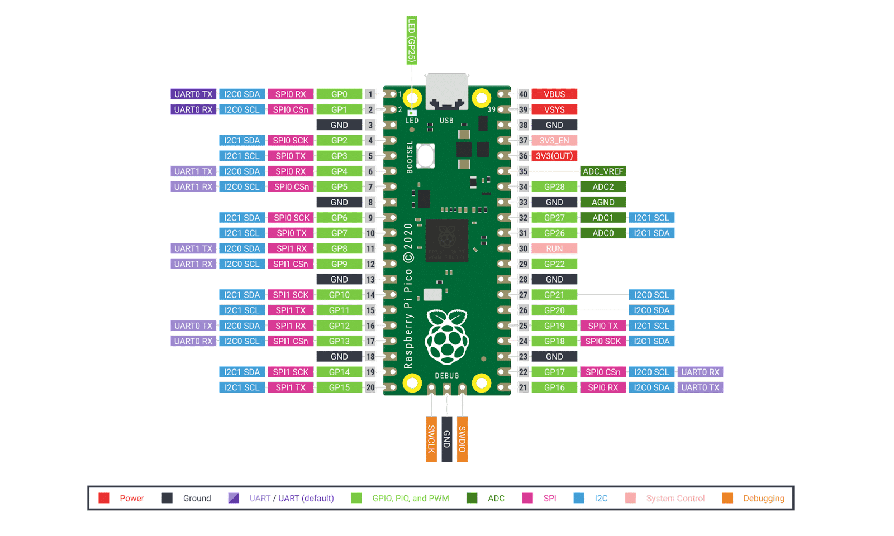

# 🎹 Raspberry Pi Pico USB-MIDI Controller (61 Teclas)

[-C51A4A.svg)](https://raspberrypi.com/)

> 🤖 **Nota de Transparência**: A documentação técnica, diagramas e estruturação deste repositório foram gerados/organizados de forma automatizada com assistência de Inteligência Artificial (Google DeepMind Antigravity / Gemini), com base no código-fonte, esquemáticos e arquitetura originais desenvolvidos pelo autor.

---

## 📸 Arquitetura de Hardware & Pinout Oficial

> **Pinagem e Mapeamento de Hardware:** Esquema oficial de conexão das linhas e colunas da matriz 8x8 nas GPIOs do microcontrolador RP2040:

  

---

## 📌 Visão Geral do Projeto

Controlador musical físico **USB-MIDI Class-Compliant** de 61 teclas desenvolvido sobre o microcontrolador **RP2040 (Raspberry Pi Pico)** com **CircuitPython**. O instrumento é reconhecido nativamente por computadores (macOS, Windows, Linux) e dispositivos móveis (Android e iOS/iPadOS via adaptador USB-OTG), sem necessidade de instalação de drivers adicionais.

O teclado faz a varredura contínua de uma **matriz 8x8** de contatos mecânicos com filtragem por debounce, enviando mensagens padrão de `NoteOn` e `NoteOff` (velocidade 127) com latência imperceptível.

---

## 🗺️ Disposição da Matriz de Teclas (8x8)

O teclado abrange do **Dó 2 ($C_2$ / MIDI 36)** até o **Dó 7 ($C_7$ / MIDI 96)**, cobrindo 5 oitavas completas:

| Linha \ Coluna | C1 | C2 | C3 | C4 | C5 | C6 | C7 | C8 |
|:---|:---:|:---:|:---:|:---:|:---:|:---:|:---:|:---:|
| **L1** | Dó 2 ($C_2$) | Dó# 2 ($C^\#_2$) | Ré 2 ($D_2$) | Ré# 2 ($D^\#_2$) | Mi 2 ($E_2$) | Fá 2 ($F_2$) | Fá# 2 ($F^\#_2$) | Sol 2 ($G_2$) |
| **L2** | Sol# 2 ($G^\#_2$) | Lá 2 ($A_2$) | Lá# 2 ($A^\#_2$) | Si 2 ($B_2$) | Dó 3 ($C_3$) | Dó# 3 ($C^\#_3$) | Ré 3 ($D_3$) | Ré# 3 ($D^\#_3$) |
| **L3** | Mi 3 ($E_3$) | Fá 3 ($F_3$) | Fá# 3 ($F^\#_3$) | Sol 3 ($G_3$) | Sol# 3 ($G^\#_3$) | Lá 3 ($A_3$) | Lá# 3 ($A^\#_3$) | Si 3 ($B_3$) |
| **L4** | Dó 4 ($C_4$) | Dó# 4 ($C^\#_4$) | Ré 4 ($D_4$) | Ré# 4 ($D^\#_4$) | Mi 4 ($E_4$) | Fá 4 ($F_4$) | Fá# 4 ($F^\#_4$) | Sol 4 ($G_4$) |
| **L5** | Sol# 4 ($G^\#_4$) | Lá 4 ($A_4$) | Lá# 4 ($A^\#_4$) | Si 4 ($B_4$) | Dó 5 ($C_5$) | Dó# 5 ($C^\#_5$) | Ré 5 ($D_5$) | Ré# 5 ($D^\#_5$) |
| **L6** | Mi 5 ($E_5$) | Fá 5 ($F_5$) | Fá# 5 ($F^\#_5$) | Sol 5 ($G_5$) | Sol# 5 ($G^\#_5$) | Lá 5 ($A_5$) | Lá# 5 ($A^\#_5$) | Si 5 ($B_5$) |
| **L7** | Dó 6 ($C_6$) | Dó# 6 ($C^\#_6$) | Ré 6 ($D_6$) | Ré# 6 ($D^\#_6$) | Mi 6 ($E_6$) | Fá 6 ($F_6$) | Fá# 6 ($F^\#_6$) | Sol 6 ($G_6$) |
| **L8** | Sol# 6 ($G^\#_6$) | Lá 6 ($A_6$) | Lá# 6 ($A^\#_6$) | Si 6 ($B_6$) | Dó 7 ($C_7$) | Dó# 7 ($C^\#_7$) | Ré 7 ($D_7$) | Ré# 7 ($D^\#_7$) |

---

## 🔌 Mapeamento de GPIO do Raspberry Pi Pico

Consulte o [Diagrama de Pinagem Oficial do Pico](https://embarcados.com.br/wp-content/uploads/2023/07/image-8.png):

### Linhas (Outputs / Flat Esquerdo)
- **L1**: `GP2`
- **L2**: `GP3`
- **L3**: `GP4`
- **L4**: `GP5`
- **L5**: `GP6`
- **L6**: `GP7`
- **L7**: `GP8`
- **L8**: `GP9`

### Colunas (Inputs com Pull-Up / Flat Direito)
- **C1**: `GP10`
- **C2**: `GP11`
- **C3**: `GP12`
- **C4**: `GP13`
- **C5**: `GP14`
- **C6**: `GP15`
- **C7**: `GP16`
- **C8**: `GP17`

---

## 🚀 Como Instalar e Configurar o Firmware

1. **Instale o CircuitPython**:
   - Baixe o arquivo `.uf2` mais recente para o seu Pico em [circuitpython.org/board/raspberry_pi_pico/](https://circuitpython.org/board/raspberry_pi_pico/).
   - Segure o botão `BOOTSEL` do Pico e conecte-o via USB ao computador.
   - Arraste o arquivo `.uf2` para a unidade montada `RPI-RP2`. A placa reiniciará como uma unidade de disco chamada `CIRCUITPY`.

2. **Copie as Bibliotecas**:
   - Baixe o pacote de bibliotecas do CircuitPython em [circuitpython.org/libraries](https://circuitpython.org/libraries).
   - Copie a pasta `adafruit_midi` para dentro da pasta `lib/` na unidade `CIRCUITPY`.

3. **Configure o Boot Especial (`boot.py`)**:
   - Salve o arquivo `src/boot.py` na raiz da unidade `CIRCUITPY`.
   - Este arquivo ativa o modo de instrumento musical USB (`usb_midi.enable()`) e oculta a porta serial desnecessária (`usb_cdc.disable()`).

4. **Copie o Código Principal (`code.py`)**:
   - Salve o arquivo `src/code.py` na raiz da unidade `CIRCUITPY`.
   - Reinicie a placa e seu teclado estará 100% operacional!

---

## 📱 Softwares e DAWs Compatíveis

### No Celular / Tablet (Requer adaptador USB OTG):
- [FluidSynth MIDI Synthesizer (Google Play Store)](https://play.google.com/store/apps/details?id=net.volcanomobile.fluidsynthmidi&hl=pt_BR)
- GarageBand (iOS / iPadOS)

### No Computador (macOS / Windows):
- **Apple Logic Pro** e **GarageBand** (macOS)
- **Native Instruments Kontakt 8**
- **Cakewalk Sonar**
- **Ableton Live**, **FL Studio**, **Reaper**
*(Basta selecionar "Raspberry Pi Pico MIDI" como dispositivo de entrada nas preferências de áudio/MIDI do software).*

---

## 👨‍💻 Autor

Desenvolvido por **Enzo Grasciano de Figueiredo**  
Universidade Federal do Paraná (UFPR)  
E-mail: enzo.g.figueiredo@gmail.com  
GitHub: [@enzo-grasciano-de-figueiredo](https://github.com/enzo-grasciano-de-figueiredo)
